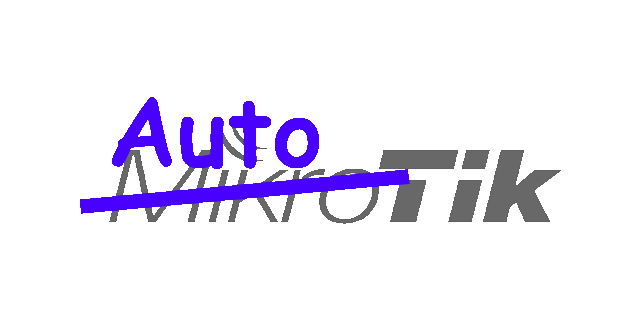
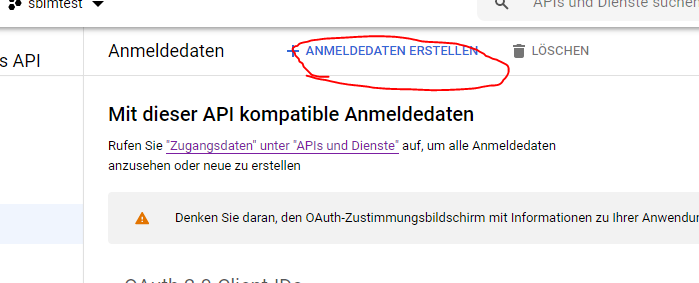
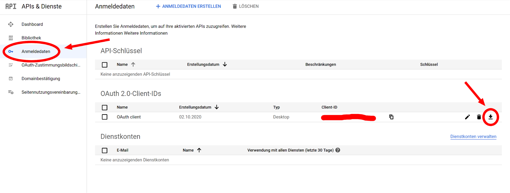

<div align="center">
    
</div>

---

## 📝 About

*Don't you find having to create new users for your MikroTik Hotspot service by hand every time annoying as well?* If you do, this is **the repository for you**!

> *AutoTik* - making Hotspot user creation simpler than breathing since October 2020.

## 📁 Table Of Contents

- [📝 About](#-about)
- [📁 Table Of Contents](#-table-of-contents)
- [⚙ Setup](#-setup)
- [🕹 Usage](#-usage)
  - [Starting the Server](#starting-the-server)
  - [Adding users](#adding-users)
  - [The users panel](#the-users-panel)
  - [Troubleshooting](#troubleshooting)
- [🖊 How to `config.json`](#-how-to-configjson)
  - [Port](#port)
  - [Printer](#printer)
  - [Phone](#phone)
  - [Booth](#booth)
  - [Wi-Fi](#wi-fi)
  - [Mgm](#mgm)
  - [Sheets](#sheets)
- [🌍 How to Google Sheets](#-how-to-google-sheets)
- [🔐 How to credentials.json](#-how-to-credentialsjson)

## ⚙ Setup

Setting up the repository is rather simple. Just make sure you have a somewhat newer version of [NodeJS](https://nodejs.org/) installed & running - something like `v14.17` should be fine. Also, you'll need `npm` to download & install the dependencies - make sure you have at least `v7.20.3`.

```bash
git clone https://github.com/SBim-BeSt-Kaindorf/autotik
cd autotik
npm i
```

## 🕹 Usage

The following are the core features of our lovely *AutoTik* software. Bear in mind, however, that this repository is still under heavy development and so cool new things might be added at any point.

1. Creating MikroTik Hotspot Users
2. Storing Users in Google Sheets
3. Printing User Credentials over the Network
4. Providing Live Usage Statistics

### Starting the Server

**1.** Do this, to get *AutoTik* up and running. First, start the server with a short command:

```bash
npm start
```


**2.** You should now be able to open your browser at the address that was output to the console ([localhost:1234](http://localhost:1234/) by default) and see something like the following website appear:


**3.** However, clicking on the database symbol in the top-right corner of your screen to open the *users dashboard* should give you the following message in the terminal where you launched the server:


**4.** Simply do as you're told! Open the given URL, choose your Google account that contains the spreadsheet in which you want to store your user credentials and paste the code Google eventually gives you back into the prompt:


**5.** After pasting the code into the terminal, the server could potentially crash. If it does, simply restart it using `[Ctrl]` + `[C]` and `npm start` again. Don't worry, however, *it's not a bug, it's a feature!* ;)


**6.** Either way... now you should be able to access the *user dashboard* by clicking the *database icon* in the top-right corner.


### Adding users

With our *fully automated user creator* creating users is no problem at all:

**1.** Open the main page (`localhost:1234` by default)
**2.** Now... simply fill in the fields (the greyed-out ones, such as *Standnummer*, being optional) and press *Erstellen*:


**3.** If everything goes well, the user is created on the *MikroTik*, added to the Google Sheets table (more on that [later](#How-to-Google-Sheets)) and it will start printing:


**4.** However, this is the part where you start praying that the printer doesn’t cause any trouble… If it does… Then deciphering the given error code could be rather difficult *(we didn’t find any proper documentation of these codes, we only know that <ins>error 0</ins> means the printer is not reachable → either you have the wrong ip in config.json or the printer is not connected to the network)*. Since we didn’t have access to the printer when testing this new, automated printing system, we got the following error message (in your case, it will hopefully work):


**5.** Even if you do get a printing error, however, you can still view the newly created user in the users panel… (it will also exist on the *Mikrotik* device)

### The users panel

Simply open the users panel from the main web page or by entering its URL (`localhost:1234/users` by default). The rest *should* be self-explanatory.

... TODO ...

### Troubleshooting

**1.** If you get the following warning when trying to start the server


… it means that establishing a connection to the *Mikrotik* device failed. Check whether or not you’re in the **correct network** and adjust the mgm.host field in **config.json** to your needs.

**2.** If, after using the web interface for some time, all of a sudden, you’re not able to load any pages any more…


… check whether or not your notebook has **lost its connection** to the *Mikrotik* device. After fixing the problem, simply restart the server again (*npm start*).

## 🖊 How to `config.json`

```json
{
    "port": 1234, // The Port of the Backend
    "printer": "<Printer-IP>", // The IP of the Receipt Printer
    "phone": "<Support Phone Number>", // Phone Number of the Responsible Person
    "booth": "SXXX", // Booth of the Computer Corner
    "wifi": {
        "ssid": "<SSID>", // SSID
        "pass": "<PWD>" // WiFi password
    },
    "mgm": {
        "host": "<Mikrotik-IP>", // IP of the Mikrotik Firewall
        "port": 22, //SSH Port
        "user": "<username>", // Username
        "pass": "<pwd>", // Password
        "user_server": "<Hotspot>" // User Network
    },
    "sheets": {
        "id": "<Google-Sheets-ID>", // Google
        "table": "<Google-Sheets-Table>" // Table within the Sheet
    }
}
```

### Port

This is the Port of the NodeJS Backend Server. It doesn't really matter what Port you choose, as long as you remember it and it’s not being used by another service.

### Printer

This is the IP address of the EPson receipt printer, which (at the moment) is not statically assigned on the Firewall, since we don’t know the MAC. You **HAVE TO** change this to the right address.

### Phone

This will be the phone number of the responsible person → the student, which will be at the SBIM/Best at all times. (so probably the project manager). This represents the "Problem-Hotline".

🖨 *Will be printed onto the receipt.*

### Booth

This should be changed to the booth number of the “Computer Corner”, so that customers can find you, if they do not wanna call.

🖨 *Will be printed onto the receipt.*

### Wi-Fi

These are the wifi credentials needed to actually connect to the APs. The customers need this to connect to the Wifi. `ssid` is the SSID and `pass` is the password.

🖨 *Will be printed onto the receipt.*

### Mgm

This is the Mikrotik Firewall. It manages the users and is therefore needed for this to work ;)

| attribute name | attribute dscription                                                   |
| -------------- | ---------------------------------------------------------------------- |
| `host`         | the IP address of the firewall; shouldn't need to be changed           |
| `port`         | the username for logging in                                            |
| `pass`         | the password                                                           |
| `user_server`  | the "server" to which the user (customer) accounts will be assigned to |

***@KaindorfGroup**: There should be no need to change these values for the next SBim/BeSt.*

### Sheets

This is the "database" for the user accounts. It is just a Google spreadsheet to which all credentials will be appended.

| attribute name | attribute value                         |
| -------------- | --------------------------------------- |
| `id`           | the ID of the sheets document           |
| `table`        | the table to which data should be added |

*View [the next section](#how-to-google-sheets) for more info.*

## 🌍 How to Google Sheets


Make sure you have the same table layout as we do:

***@KaindorfGroup**: You can copy last year's table, found at "SBIM&BEST3/\<year\>/_Organisation/Kunden/Captive Portal User" and delete all unnecessary entries*


## 🔐 How to credentials.json

**1.** Go to [console.developers.google.com](https://console.developers.google.com/)
**2.** Create a new project


**3.** Now theoogle hets API has to be actives for this project


**4.** In the Google Sheets API Screen (you should get redirected after the previous step) under *Credentials* create a new *OAuth Client ID*





... for that to work, you have to create a consent screen first:


... here we don't recommend uploading an image, because this would have to be reviewd by Google first, which takes quite some time.

Lastly the *OAuth-Client-ID* will be created and in the following window you need to select "desktop application"


**5.** After the API Project was successfully created, all that's left to do is navigate to *Credentials*, download the correct *json* file as *credentials.json* and put it in the server's directory.


